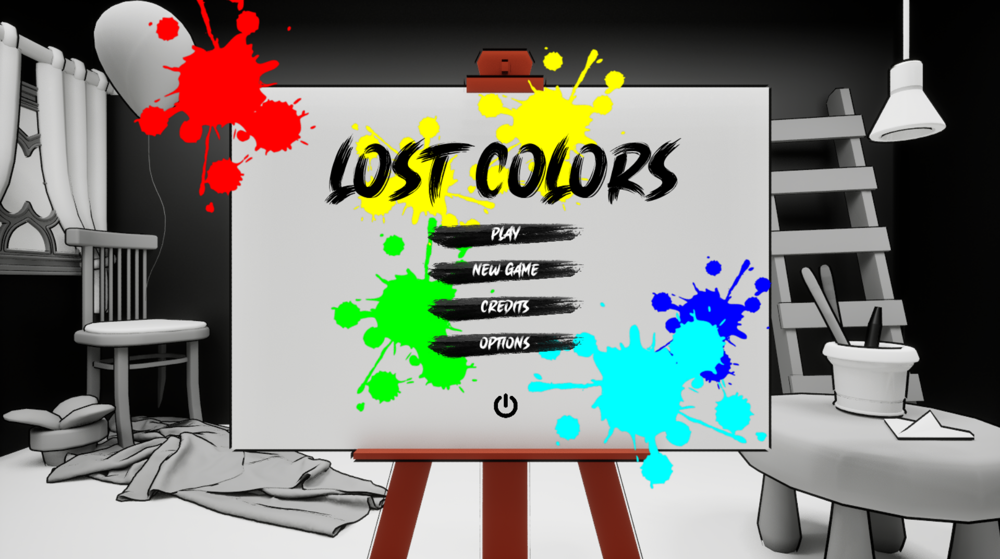
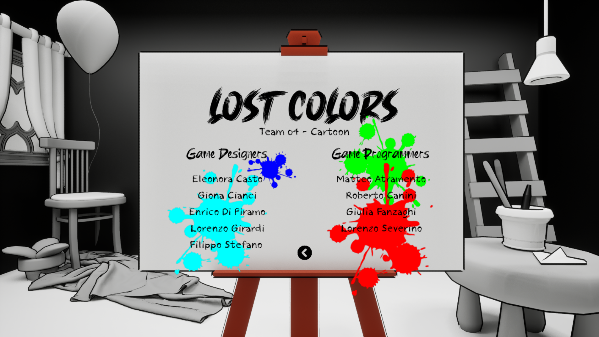
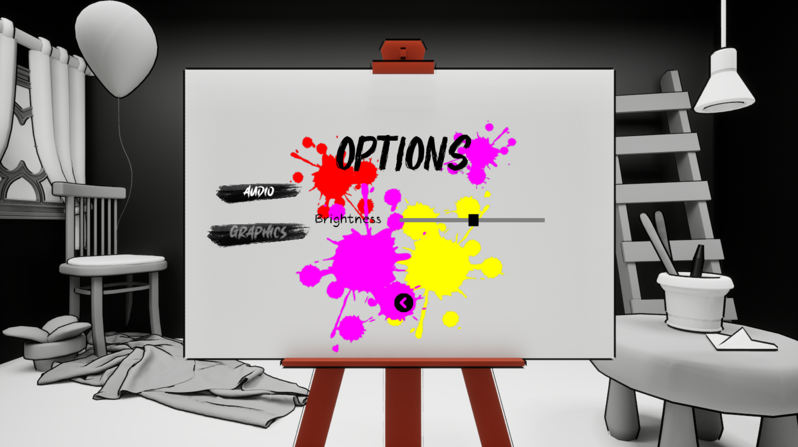
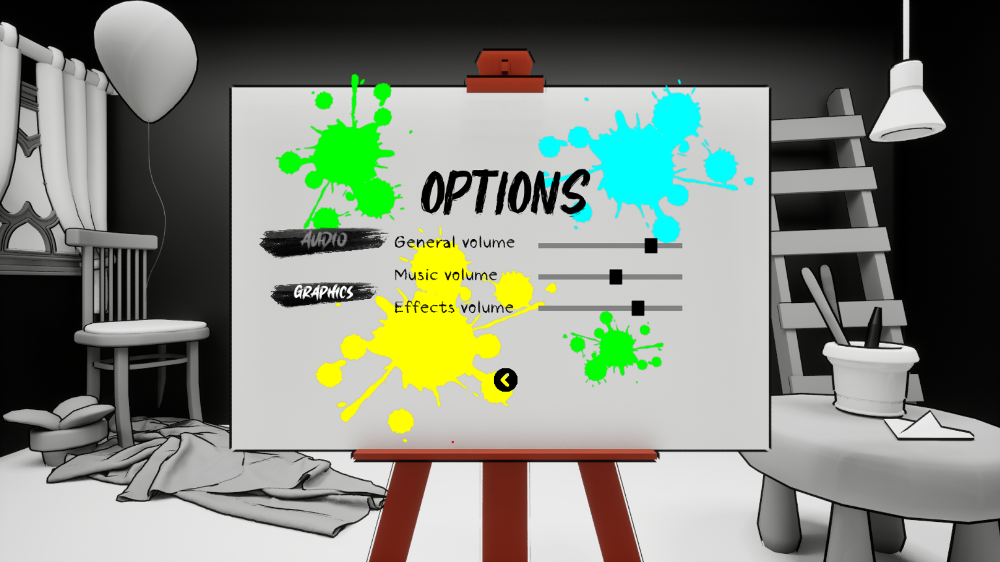
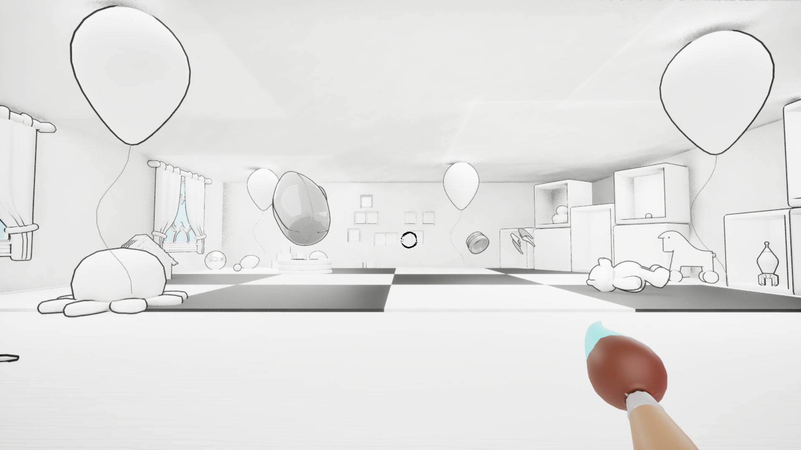
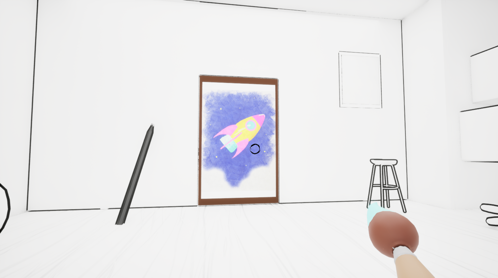
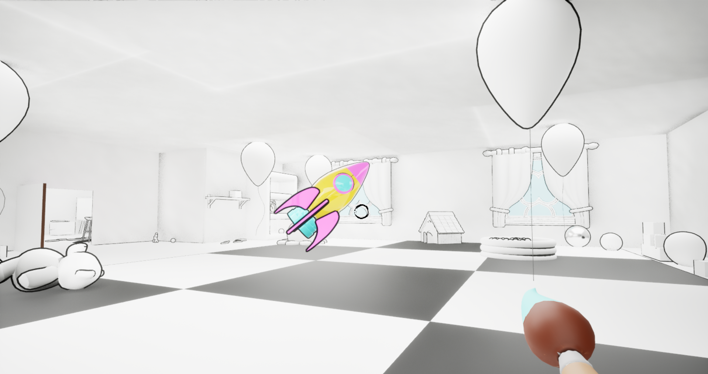

#  Lost-Colors

Lost Colors is a **first-person puzzle game** in which the player needs to escape from a B/W world with the help of their **Color Brush** and a perspective way of thinking.

##  Development:
The game has been developed using **Unreal Engine 5**. It was an academic project for the course of Game Programming at the **Digital Bros. Game Academy** in Milan, Italy. We had 3 months to develop the game, from scratch, under the supervision of teachers and industry experts. The team was composed of 9 people: 4 Programmers and 5 Game Designers.

## 🎮 My contribution to the game
I was one of the four programmers in the team.  
My main contributions were:  
 - The implementation of the objects logic, in particular the right-color checks on the single parts of the fragments that have to be painted to solve the puzzles and the communication between every parts so that the main object knows if it's ready to rebuild;
 - The game workflow, working on the UI from the game intro to the game end; in this case, because of the limited time we had to develop the whole project, I made the HUD classes instantiate different Widget pages based on the point of the game you were in and certain events such as game end;

##  Do you want to play the game?
The game is finished and available on [DBGA's itch.io](https://digital-bros-game-academy.itch.io/lost-colors)!

## 🕹️ Gameplay and images
 
  

